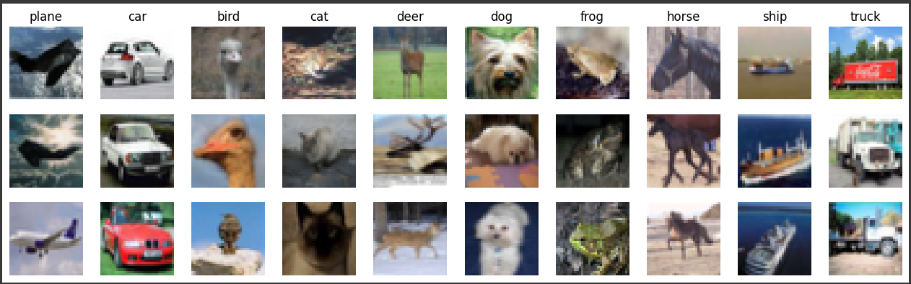
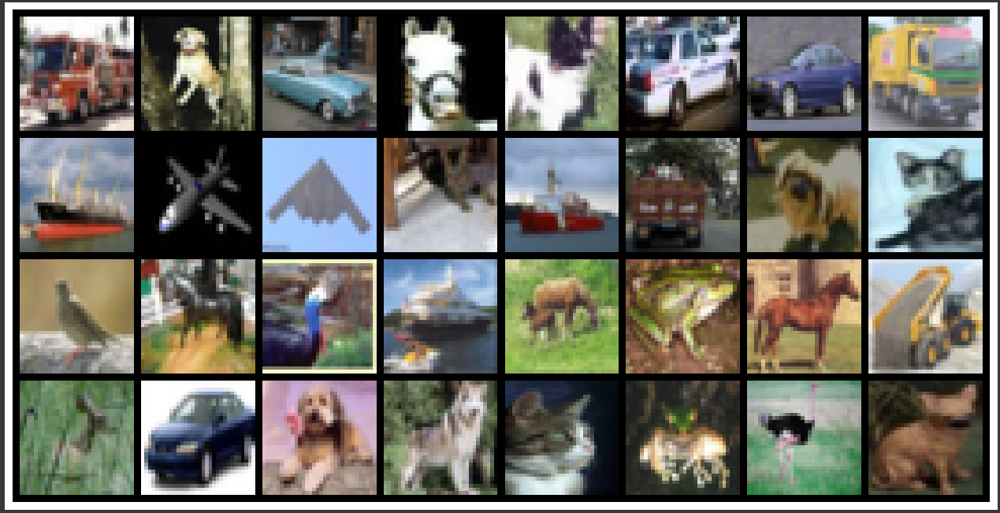
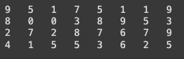
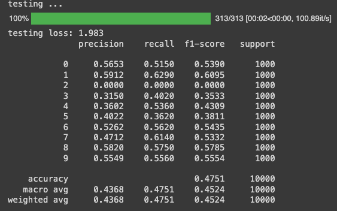
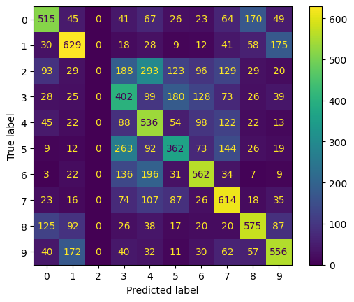
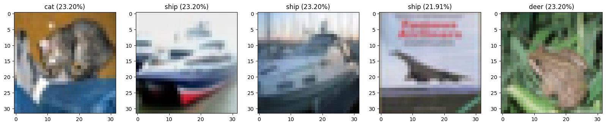

# 1. Image classification (basic): CIFAR10

Aim to classify images into 10 classes of cifar10 dataset using pytorch.

<br />

### 1. Data Transformations
```python
transform = transforms.Compose( # transform is from torchvision (only for image)
    [transforms.ToTensor(), # image to tensor --> divide by 255
     transforms.Resize((32, 32))])

batch_size = 32
```
Convert image to tensor and resize image to 32x32 px

<br />

### 2. Load CIFAR10 Dataset
```python
trainvalset = torchvision.datasets.CIFAR10(root='./data', train=True, download=True, transform=transform)
trainset, valset = torch.utils.data.random_split(trainvalset, [40000, 10000])

trainloader = torch.utils.data.DataLoader(trainset, batch_size=batch_size, shuffle=True)
valloader = torch.utils.data.DataLoader(valset, batch_size=batch_size, shuffle=False)

testset = torchvision.datasets.CIFAR10(root='./data', train=False, download=True, transform=transform)
testloader = torch.utils.data.DataLoader(testset, batch_size=batch_size, shuffle=False)

#classes = ('plane', 'car', 'bird', 'cat', 'deer', 'dog', 'frog', 'horse', 'ship', 'truck')
```
Load CIFAR10 dataset and split into train, validation and test set.

<br />

### 3. Visualizing Random Images from Classes
```python
import numpy as np
import matplotlib.pyplot as plt


def PlotRandomFromEachClass(X,Y,N,labels):
    C = np.unique(Y)
    M = len(C)
    plt.figure(figsize=(16, N*1.5))
    for i in range(M):
        mask = np.squeeze(Y == C[i])
        indexes = np.random.choice(X.shape[0], N, replace=False, p=mask/sum(mask))
        for j in range(N):
            plt.subplot(N,M,j*M+i+1)
            plt.imshow(X[indexes[j]], aspect="equal")
            plt.axis("off")
            if j == 0:
                plt.title(labels[i])

classes = ('plane', 'car', 'bird', 'cat', 'deer', 'dog', 'frog', 'horse', 'ship', 'truck')
PlotRandomFromEachClass(trainset.dataset.data, trainset.dataset.targets, 3, labels=classes)
```
Randomly selecting and displaying 3 images from each class in a grid layout. It uses `numpy` to handle data and `matplotlib` to plot the images.



<br />

### 4. Visualizing a Batch of Training Images
```python
# functions to show an image
def imshow(img):
    npimg = img.numpy()
    plt.figure(figsize=(16,16))
    plt.imshow(np.transpose(npimg, (1, 2, 0)))
    plt.axis("off")
    plt.show()

# get some random training images
dataiter = iter(trainloader)
images, labels = next(dataiter)

# show images
nrow = 8
imshow(torchvision.utils.make_grid(images, nrow = nrow))
```
Provides a visual preview of a batch of training images arranged in a grid, making it easy to inspect the data you’re working with.\
`imshow(img)`: A helper function to convert and display a tensor image.\
`dataiter and images, labels`: Fetches a batch of images from the training data.\
`torchvision.utils.make_grid`: Arranges images into a grid.\
`imshow`: Displays the grid of images with 8 images per row.



<br />

```python
# print labels
for i in range(batch_size//nrow+1 if batch_size % nrow else batch_size//nrow):
  print(' '.join(f'{labels[i*nrow+j]:<3}' for j in range(min(batch_size - i*nrow, nrow))))
```
Prints the labels of the images in the batch. \


<br />

### 5. Define CNN Model
```python
import torch.nn as nn
import torch.nn.functional as F

class CNN(nn.Module):
    def __init__(self):
        super().__init__()
        self.conv1 = nn.Conv2d(3, 6, 5) # 3 input channels, 6 output channels, 5*5 kernel size
        self.pool = nn.MaxPool2d(2, 2) # 2*2 kernel size, 2 strides
        self.conv2 = nn.Conv2d(6, 16, 5)
        self.fc1 = nn.Linear(400, 120) # dense input 400 (16*5), output 120

        self.fc2 = nn.Linear(120, 84) # dense input 120, output 84
        self.fc3 = nn.Linear(84, 10) # dense input 84, output 10
        self.softmax = torch.nn.Softmax(dim=1) # perform softmax at dim[1] (batch,class)

    def forward(self, x):
        x = self.pool(F.relu(self.conv1(x)))
        x = self.pool(F.relu(self.conv2(x)))
        x = torch.flatten(x,start_dim=1) # flatten all dimensions (dim[1]) except batch (dim[0])
        x = F.relu(self.fc1(x))
        x = F.relu(self.fc2(x))
        x = self.fc3(x)
        x = self.softmax(x)
        return x

net = CNN().to(device)
```

Defines a Convolutional Neural Network (CNN) using PyTorch for image classification.\
**Model Structure**
- `Two Convolutional Layers`: These layers detect features in the images, such as edges and textures.
- `Pooling Layers`: Reduce the size of the data while keeping important information, making the model more efficient.
- `Three Fully Connected Layers`: These layers take the extracted features and learn to classify the images into one of 10 classes.
- `Softmax Layer`: Converts the final outputs into probabilities for each class, helping to determine the most likely class for each image.\

The `net` variable creates an instance of the CNN model and transfers it to a CPU or GPU for training or testing.

<br />

```python
#from torchsummary import summary
#summary(net, (3, 100, 100), batch_size = 32)

from torchinfo import summary as summary_info
print(summary_info(net, input_size = (32, 3, 32, 32))) # (batchsize,channel,width,height)
net = net.to(device)
```
Obtain a comprehensive summary of your CNN model, which includes information about each layer, output shapes, and the total number of parameters
```
Layer (type:depth-idx)                   Output Shape              Param #
==========================================================================================
CNN                                      [32, 10]                  --
├─Conv2d: 1-1                            [32, 6, 28, 28]           456
├─MaxPool2d: 1-2                         [32, 6, 14, 14]           --
├─Conv2d: 1-3                            [32, 16, 10, 10]          2,416
├─MaxPool2d: 1-4                         [32, 16, 5, 5]            --
├─Linear: 1-5                            [32, 120]                 48,120
├─Linear: 1-6                            [32, 84]                  10,164
├─Linear: 1-7                            [32, 10]                  850
├─Softmax: 1-8                           [32, 10]                  --
==========================================================================================
Total params: 62,006
Trainable params: 62,006
Non-trainable params: 0
Total mult-adds (M): 21.06
==========================================================================================
Input size (MB): 0.39
Forward/backward pass size (MB): 1.67
Params size (MB): 0.25
Estimated Total Size (MB): 2.31
==========================================================================================
```

<br />

### 7. Training the Model
```python
import torch.optim as optim

criterion = nn.CrossEntropyLoss()
optimizer = optim.SGD(net.parameters(), lr=1e-2, momentum=0.9)
```
Sets up the loss function `nn.CrossEntropyLoss())` and the optimizer `optim.SGD` needed to train the neural network model from `net`.

<br />

```python
from sklearn.metrics import classification_report
from sklearn.metrics import confusion_matrix
from tqdm.notebook import tqdm

epochs = 20

history_train = {'loss':np.zeros(epochs), 'acc':np.zeros(epochs), 'f1-score':np.zeros(epochs)}
history_val = {'loss':np.zeros(epochs), 'acc':np.zeros(epochs), 'f1-score':np.zeros(epochs)}
min_val_loss = 1e10
PATH = './CNN_CIFAR10.pth'

for epoch in range(epochs):  # loop over the dataset multiple times

    print(f'epoch {epoch + 1} \nTraining ...')
    y_predict = list()
    y_labels = list()
    training_loss = 0.0
    n = 0
    net.train()
    for data in tqdm(trainloader):
        # get the inputs; data is a list of [inputs, labels]
        inputs, labels = data
        inputs = inputs.to(device)
        labels = labels.to(device)

        # zero the parameter gradients
        optimizer.zero_grad()

        # forward + backward + optimize
        outputs = net(inputs) # forward
        loss = criterion(outputs, labels) # calculate loss from forward pass
        loss.backward() # just calculate
        optimizer.step() # update weights here

        # aggregate statistics
        training_loss += loss.item()
        n+=1

        y_labels += list(labels.cpu().numpy())
        y_predict += list(outputs.argmax(dim=1).cpu().numpy())

    # print statistics
    report = classification_report(y_labels, y_predict, digits = 4, output_dict = True)
    acc = report["accuracy"]
    f1 = report["weighted avg"]["f1-score"]
    support = report["weighted avg"]["support"]
    training_loss /= n
    print(f"training loss: {training_loss:.4}, acc: {acc*100:.4}%, f1-score: {f1*100:.4}%, support: {support}" )
    history_train['loss'][epoch] = training_loss
    history_train['acc'][epoch] = acc
    history_train['f1-score'][epoch] = f1

    print('validating ...')
    net.eval()
    y_predict = list()
    y_labels = list()
    validation_loss = 0.0
    n = 0
    with torch.no_grad():
        for data in tqdm(valloader):
            inputs, labels = data
            inputs = inputs.to(device)
            labels = labels.to(device)

            outputs = net(inputs)
            loss = criterion(outputs, labels)
            validation_loss += loss.item()

            y_labels += list(labels.cpu().numpy())
            y_predict += list(outputs.argmax(dim=1).cpu().numpy())
            n+=1

    # print statistics
    report = classification_report(y_labels, y_predict, digits = 4, output_dict = True)
    acc = report["accuracy"]
    f1 = report["weighted avg"]["f1-score"]
    support = report["weighted avg"]["support"]
    validation_loss /= n
    print(f"validation loss: {validation_loss:.4}, acc: {acc*100:.4}%, f1-score: {f1*100:.4}%, support: {support}" )
    print("_____________________________________________________________________")
    history_val['loss'][epoch] = validation_loss
    history_val['acc'][epoch] = acc
    history_val['f1-score'][epoch] = f1

    #save min validation loss
    if validation_loss < min_val_loss:
        torch.save(net.state_dict(), PATH)
        min_val_loss = validation_loss

print('Finished Training')
```
Trains a CNN model on the CIFAR-10 dataset over 20 epochs, calculating and displaying training and validation loss, accuracy, and F1-score after each epoch. It saves the model whenever the validation loss decreases, ensuring the best-performing model is retained.

<br />

### 8. Testing the Model
```python
from sklearn.metrics import confusion_matrix,ConfusionMatrixDisplay

print('testing ...')
y_predict = list()
y_labels = list()
test_loss = 0.0
n = 0
with torch.no_grad():
    for data in tqdm(testloader):
        inputs, labels = data
        inputs = inputs.to(device)
        labels = labels.to(device)

        outputs = net(inputs)
        loss = criterion(outputs, labels)
        test_loss += loss.item()

        y_labels += list(labels.cpu().numpy())
        y_predict += list(outputs.argmax(dim=1).cpu().numpy())
        n+=1

    # print statistics
    test_loss /= n
    print(f"testing loss: {test_loss:.4}" )

    report = classification_report(y_labels, y_predict, digits = 4)
    M = confusion_matrix(y_labels, y_predict)
    print(report)
    disp = ConfusionMatrixDisplay(confusion_matrix=M)
    #acc = report["accuracy"]
    #f1 = report["weighted avg"]["f1-score"]
    #support = report["weighted avg"]["support"]
    #test_loss /= n
    #print(f"validation loss: {test_loss:.4}, acc: {acc*100:.4}%, f1-score: {f1*100:.4}%, support: {support}" )
```
Performs evaluation of the trained CNN model on the test dataset. It calculates the average test loss, generates a detailed classification report showing metrics like precision, recall, and F1-score for each class, and computes the confusion matrix to visualize the model's performance across different classes.

 \


<br />

### 9. Visualizing Predictions
```python
plt.figure(figsize=(20,5))
dataiter = iter(testloader)
inputs, labels = next(dataiter)
with torch.no_grad():
        net.eval()
        inputs = inputs.to(device)
        labels = labels.to(device)

        outputs = net(inputs)
        loss = criterion(outputs, labels)
        test_loss += loss.item()

        y_labels = list(labels.cpu().numpy())
        y_predict = list(outputs.argmax(dim=1).cpu().numpy())
        # To get probabilities, you can run a softmax on outputs
        y_probs = torch.nn.functional.softmax(outputs, dim=1)
        y_probs = list(y_probs.cpu().numpy())

# We selected a sample from the first five images for visualization
for i in range(5):
    plt.subplot(1,5,i+1)
    img = inputs[i]     # unnormalize
    npimg = img.cpu().numpy()
    plt.imshow(np.transpose(npimg, (1, 2, 0)))

    most_prob = np.argmax(y_probs[i])
    label = classes[most_prob]
    prob = y_probs[i][most_prob]
    plt.title(f"{label} ({prob*100:.2f}%)")
```
Visualizes the predictions of the trained CNN model on a batch of test images. \


---

### Steps Overview
1. Data Transformations
2. Load CIFAR10 Dataset
3. Visualizing Random Images from Classes
4. Visualizing a Batch of Training Images
5. Define CNN Model
6. Model Summary
7. Training the Model
8. Testing the Model
9. Visualizing Predictions

### Intensive Summary
The CNN model for CIFAR-10 classification was built with multiple convolutional layers for feature extraction, followed by pooling and fully connected layers for classification. The model was trained using Cross-Entropy Loss and optimized with SGD and momentum. Training was conducted over 25-50 epochs, with optional data augmentation to improve performance

### Results
The model achieved a test accuracy between 70% and 85%, with a consistent decrease in loss over time. Predictions were confident, with probabilities often exceeding 85% for the correct classifications.

<br />

Reference: \
https://colab.research.google.com/github/pvateekul/2110531_DSDE_2024s1/blob/main/code/Week04_DL/1_Image_classification_CIFAR10_CNN.ipynb
