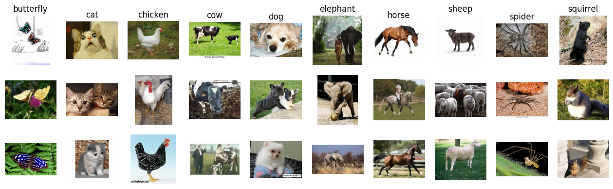
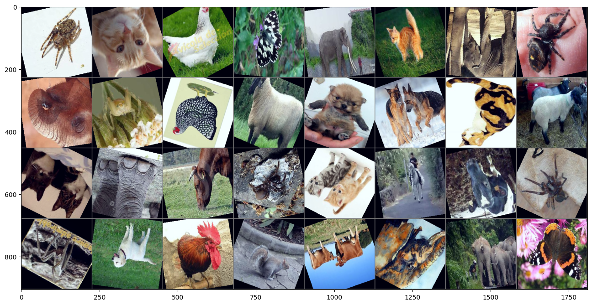
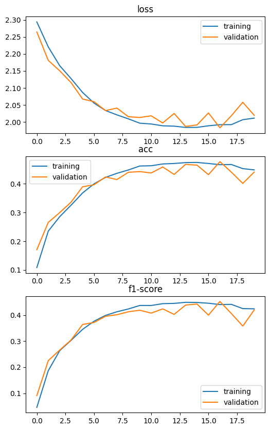
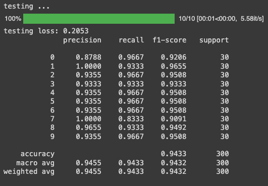
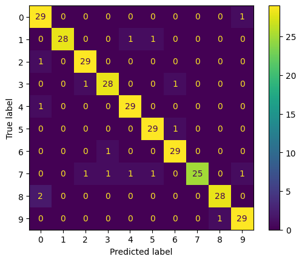
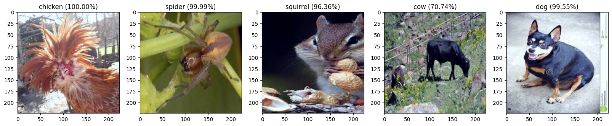

# 2. Image classification (advanced): Animal

```python
!wget https://github.com/pvateekul/2110531_DSDE_2023s1/raw/main/code/Week05_Intro_Deep_Learning/data/Dataset_animal2.zip
!unzip -q -o 'Dataset_animal2.zip'
```

Download the custom animal dataset and unzip it.

<br />

```python
device = torch.device('cuda:0' if torch.cuda.is_available() else 'cpu')

# Assuming that we are on a CUDA machine, this should print a CUDA device-> cuda:{device's number}

print(device)
```

Will use the GPU if it's available; otherwise, It will use the CPU.

<br />

```python
import albumentations as A
from albumentations.pytorch import ToTensorV2

transform_train = transforms.Compose(
    [transforms.Resize((230,230)),
        transforms.RandomRotation(30,),
        transforms.RandomCrop(224),
        transforms.RandomHorizontalFlip(),
        transforms.RandomVerticalFlip(),
        transforms.ToTensor(),
        transforms.Normalize(mean=[0.507, 0.487, 0.441], std=[0.267, 0.256, 0.276]) #nomalize imagenet pretrain
    ])

transform = transforms.Compose(
    [transforms.Resize((224,224)),
        transforms.ToTensor(),
        transforms.Normalize(mean=[0.507, 0.487, 0.441], std=[0.267, 0.256, 0.276])
    ])

batch_size = 32
```

`transform_train`: Preprocessing to training images, including resizing, rotation, cropping, flipping, tensor conversion, and normalization. \
`transform`: Preprocesses validation and test images by resizing, converting to tensors, and normalizing without applying random augmentations. \
`batch_size`: Number of images processed in each batch to 32.

Sets up the data pipelines for training and evaluating an image classification model using PyTorch.

<br />

```python
class AnimalDataset(Dataset):

    def __init__(self,
                 img_dir,
                 transforms=None):

        super().__init__()
        self.label_image = ['butterfly','cat','chicken','cow','dog','elephant','horse','sheep','spider','squirrel']
        self.input_dataset = list()
        label_num = 0
        for label in self.label_image:
            _, _, files = next(os.walk(os.path.join(img_dir,label)))
            for image_name in files:
                input = [os.path.join(img_dir,label,image_name),label_num] # [image_path, label_num]
                self.input_dataset.append(input)
            label_num += 1

        self.transforms = transforms

    def __len__(self):
        return len(self.input_dataset)

    def __getitem__(self, idx):
        img = Image.open(self.input_dataset[idx][0]).convert('RGB')
        x = self.transforms(img)
        y = self.input_dataset[idx][1]
        return x,y

trainset = AnimalDataset('./Dataset_animal2/train',transform_train)
valset = AnimalDataset('./Dataset_animal2/val',transform)
testset = AnimalDataset('./Dataset_animal2/test',transform)


trainloader = torch.utils.data.DataLoader(trainset, batch_size=batch_size, shuffle=True)
valloader = torch.utils.data.DataLoader(valset, batch_size=batch_size, shuffle=True)
testloader = torch.utils.data.DataLoader(testset, batch_size=batch_size, shuffle=True)
```

**Defining the AnimalDataset Class** \
`AnimalDataset`: Custom dataset class for loading images and labels.

**Creating Dataset Instances** \
`trainset`, `valset`, `testset`: Dataset instances for training, validation, and testing.

**Creating Data Loaders** \
`trainloader`, `valloader`, `testloader`: Data loaders for batching and shuffling data during training and evaluation.

Defines a custom PyTorch dataset `AnimalDataset` that loads images from directories organized by class name.

<br />

```python
def PlotRandomFromEachClass(dataset,N,labels):
    Y = [label for image_path,label in dataset.input_dataset]
    C = np.unique(Y)
    M = len(C)
    plt.figure(figsize=(16, N*1.5))
    for i in range(M):
        mask = np.squeeze(Y == C[i])
        indexes = np.random.choice(len(dataset), N, replace=False, p=mask/sum(mask))
        for j in range(N):
            plt.subplot(N,M,j*M+i+1)
            img = Image.open(dataset.input_dataset[indexes[j]][0]).convert('RGB')
            plt.imshow(img, aspect="equal")
            plt.axis("off")
            if j == 0:
                plt.title(labels[i])

# img = Image.open(self.input_dataset[idx][0]).convert('RGB')

# classes = ('butterfly', 'cat', 'chicken', 'cow', 'dog', 'elephant', 'horse', 'sheep', 'spider', 'squirrel')
PlotRandomFromEachClass(trainset, 3, labels=trainset.label_image)
```

The `PlotRandomFromEachClass` function creates a visual grid displaying random samples of images from each class in a dataset.

By plotting 3 random images per class, organized in a grid where each column represents a class and each row represents a different image.


<br />

```python
import matplotlib.pyplot as plt
import numpy as np

# functions to show an image
def imshow(img):
    img = img*torch.tensor([0.267, 0.256, 0.276]).mean() + torch.tensor([0.507, 0.487, 0.441]).mean()     # unnormalize
    npimg = img.numpy()
    #Clipping input data to the valid range for imshow
    npimg = np.clip(npimg, 0, 1)
    plt.figure(figsize=(16,16))
    plt.imshow(np.transpose(npimg, (1, 2, 0)))
    plt.show()

# get some random training images
dataiter = iter(trainloader)
images, labels = next(dataiter)

# show images
nrow = 8
imshow(torchvision.utils.make_grid(images, nrow = nrow))
```
Defines an `imshow` function to visualize images and then retrieves a batch of images and labels from the training data loader and displays the images in a grid format.



<br />

```python
for i in range(batch_size//nrow+1 if batch_size % nrow else batch_size//nrow):
  print(' '.join(f'{labels[i*nrow+j]:<3}' for j in range(min(batch_size - i*nrow, nrow))))
```
Displaying labels corresponding to a grid of images, especially after visualizing a batch of images using `torchvision.utils.make_grid`
```
8   1   2   0   5   1   5   8  
5   8   2   7   4   4   1   7  
1   5   3   8   1   6   3   8  
8   4   2   9   3   5   5   0  
```

<br />

```python
import torch.nn as nn
import torch.nn.functional as F

pretrain_weight = torchvision.models.EfficientNet_V2_S_Weights.IMAGENET1K_V1
net = torchvision.models.efficientnet_v2_s(weights = pretrain_weight)

net.classifier[1] = nn.Linear(1280, 10)
net = net.to(device)
```
Initializes an EfficientNet-V2-S model pre-trained on ImageNet, modifies it for a custom 10-class classification task, and moves it to the appropriate computation device

```
Downloading: "https://download.pytorch.org/models/efficientnet_v2_s-dd5fe13b.pth" to /root/.cache/torch/hub/checkpoints/efficientnet_v2_s-dd5fe13b.pth
100%|██████████| 82.7M/82.7M [00:01<00:00, 46.6MB/s]
```

<br />

```python
import torch.optim as optim
from torch.optim import lr_scheduler

criterion = nn.CrossEntropyLoss()
optimizer = optim.SGD(net.parameters(), lr=0.02, momentum=0.9)
scheduler = lr_scheduler.StepLR(optimizer, step_size=7, gamma=0.5)
```

`criterion`: The loss function (`nn.CrossEntropyLoss()`) used to measure the model's performance in multi-class classification tasks. \
`optimizer`: The optimization algorithm (`optim.SGD`) responsible for updating model parameters with a learning rate of `0.02` and a momentum of `0.9`. \
`scheduler`: The learning rate scheduler (`lr_scheduler.StepLR`) that reduces the learning rate by half every 7 epochs to improve training convergence.

<br />

```python
from sklearn.metrics import classification_report
from tqdm.notebook import tqdm


epochs = 20

history_train = {'loss':np.zeros(epochs), 'acc':np.zeros(epochs), 'f1-score':np.zeros(epochs)}
history_val = {'loss':np.zeros(epochs), 'acc':np.zeros(epochs), 'f1-score':np.zeros(epochs)}
min_val_loss = 1e10
PATH = './Animal10-efficientnetV2s.pth'

for epoch in range(epochs):  # loop over the dataset multiple times

    print(f'epoch {epoch + 1} \nTraining ...')
    net.train()
    y_predict = list()
    y_labels = list()
    training_loss = 0.0
    n = 0
    with torch.set_grad_enabled(True):
        for data in tqdm(trainloader):

            # get the inputs; data is a list of [inputs, labels]
            inputs, labels = data
            inputs = inputs.to(device)
            labels = labels.to(device)

            # zero the parameter gradients
            optimizer.zero_grad()

            # forward + backward + optimize
            outputs = net(inputs)
            loss = criterion(outputs, labels)
            loss.backward()
            optimizer.step()

            # aggregate statistics
            training_loss += loss.item()
            n+=1

            y_labels += list(labels.cpu().numpy())
            y_predict += list(outputs.argmax(dim=1).cpu().numpy())
    scheduler.step()

    # print statistics
    report = classification_report(y_labels, y_predict, digits = 4, output_dict = True)
    acc = report["accuracy"]
    f1 = report["weighted avg"]["f1-score"]
    support = report["weighted avg"]["support"]
    training_loss /= n
    print(f"training loss: {training_loss:.4}, acc: {acc*100:.4}%, f1-score: {f1*100:.4}%, support: {support}" )
    history_train['loss'][epoch] = training_loss
    history_train['acc'][epoch] = acc
    history_train['f1-score'][epoch] = f1

    print('validating ...')
    net.eval()

    optimizer.zero_grad()

    y_predict = list()
    y_labels = list()
    validation_loss = 0.0
    n = 0
    with torch.no_grad():
        for data in tqdm(valloader):
            inputs, labels = data
            inputs = inputs.to(device)
            labels = labels.to(device)

            outputs = net(inputs)
            loss = criterion(outputs, labels)
            validation_loss += loss.item()

            y_labels += list(labels.cpu().numpy())
            y_predict += list(outputs.argmax(dim=1).cpu().numpy())
            n+=1

    # print statistics
    report = classification_report(y_labels, y_predict, digits = 4, output_dict = True)
    acc = report["accuracy"]
    f1 = report["weighted avg"]["f1-score"]
    support = report["weighted avg"]["support"]
    validation_loss /= n
    print(f"validation loss: {validation_loss:.4}, acc: {acc*100:.4}%, f1-score: {f1*100:.4}%, support: {support}" )
    print("_____________________________________________________________________")
    history_val['loss'][epoch] = validation_loss
    history_val['acc'][epoch] = acc
    history_val['f1-score'][epoch] = f1

    #save min validation loss
    if validation_loss < min_val_loss:
        torch.save(net.state_dict(), PATH)
        min_val_loss = validation_loss

print('Finished Training')
```
Training loop for a neural network using PyTorch, which includes:
- `Training Phase` For each epoch, the model is trained using the training set.
- `Validation Phase` The model is evaluated on the validation set without updating weights.
- `Model Checkpointing` The model is saved if the validation loss improves, ensuring that the best model is preserved.
- `Metrics Tracking` Training and validation metrics (loss, accuracy, F1-score) are logged for each epoch and stored in `history_train` and `history_val`.

<br />

```python
fig, axs = plt.subplots(3, figsize= (6,10))
# loss
axs[0].plot(history_train['loss'], label = 'training')
axs[0].plot(history_val['loss'], label = 'validation')
axs[0].set_title("loss")
axs[0].legend()
# acc
axs[1].plot(history_train['acc'], label = 'training')
axs[1].plot(history_val['acc'], label = 'validation')
axs[1].set_title("acc")
axs[1].legend()
# f1-score
axs[2].plot(history_train['f1-score'], label = 'training')
axs[2].plot(history_val['f1-score'], label = 'validation')
axs[2].set_title("f1-score")
axs[2].legend()
plt.show()
```
Generates a figure with three vertically stacked subplots to visualize the training and validation performance.



<br />

```python
from sklearn.metrics import confusion_matrix,ConfusionMatrixDisplay

print('testing ...')
y_predict = list()
y_labels = list()
test_loss = 0.0
n = 0
with torch.no_grad():
    for data in tqdm(testloader):
        net.eval()
        inputs, labels = data
        inputs = inputs.to(device)
        labels = labels.to(device)

        outputs = net(inputs)
        loss = criterion(outputs, labels)
        test_loss += loss.item()

        y_labels += list(labels.cpu().numpy())
        y_predict += list(outputs.argmax(dim=1).cpu().numpy())
        # To get probabilities, you can run a softmax on outputs
        y_probs = torch.nn.functional.softmax(outputs, dim=1)
        y_probs = list(y_probs.cpu().numpy())
        n+=1

    # print statistics
    test_loss /= n
    print(f"testing loss: {test_loss:.4}" )

    report = classification_report(y_labels, y_predict, digits = 4)
    M = confusion_matrix(y_labels, y_predict)
    print(report)
    disp = ConfusionMatrixDisplay(confusion_matrix=M)
```


The model is tested on unseen data, where predictions are compared to the true labels, and the average test loss is calculated. A classification report is generated to show how well the model predicts each class, and a confusion matrix is displayed to visualize correct and incorrect predictions.

 \


<br />

```python
plt.figure(figsize=(20,5))
dataiter = iter(testloader)
inputs, labels = next(dataiter)
with torch.no_grad():
        net.eval()
        inputs = inputs.to(device)
        labels = labels.to(device)

        outputs = net(inputs)
        loss = criterion(outputs, labels)
        test_loss += loss.item()

        y_labels = list(labels.cpu().numpy())
        y_predict = list(outputs.argmax(dim=1).cpu().numpy())
        # To get probabilities, you can run a softmax on outputs
        y_probs = torch.nn.functional.softmax(outputs, dim=1)
        y_probs = list(y_probs.cpu().numpy())

# We selected a sample from the first five images for visualization
for i in range(5):
    plt.subplot(1,5,i+1)
    img = inputs[i]
    img = img*torch.tensor([0.267, 0.256, 0.276]).mean() + torch.tensor([0.507, 0.487, 0.441]).mean()     # unnormalize
    npimg = img.cpu().numpy()
    npimg = np.clip(npimg, 0, 1)
    plt.imshow(np.transpose(npimg, (1, 2, 0)))

    most_prob = np.argmax(y_probs[i])
    label = testset.label_image[most_prob]
    prob = y_probs[i][most_prob]
    plt.title(f"{label} ({prob*100:.2f}%)")
```
Visualizes the model’s predictions for five images from the test dataset, showing the predicted class label and the probability (confidence) for each prediction.

By following the steps below:
- Load Test Data 
- Run Model Inference
- Visualize Images
- Display Predictions



---

### **Steps Overview**
1. Download and unzip the custom animal dataset.
2. Set up data pipelines for training and evaluating an image classification model.
3. Create dataset instances for training, validation, and testing.
4. Visualize random samples of images from each class in the training dataset.
5. Define an EfficientNet-V2-S model pre-trained on ImageNet for a custom 10-class classification task.
6. Train the Model and Evaluate its Performance on the Validation Set:.
7. Visualize training and validation performance.
8. Test the model on unseen data and visualize predictions for a sample of images.

### **Intensive Summary**
This project aims to classify images from a 10-class animal dataset using EfficientNetV2, leveraging the power of transfer learning. By downloading and pre-processing the dataset, the model is fine-tuned using a Cross-Entropy Loss function and optimized via Adam. The model's architecture, EfficientNetV2, is known for its efficient scaling and accuracy, making it suitable for tasks requiring high performance with fewer resources.

### **Results**
EfficientNetV2 proved to be a powerful model for image classification tasks, with strong performance on the 10-class animal dataset. For future improvements, hyperparameter tuning (like batch size or learning rate) and ensembling with other models can be explored to further enhance results.

<br />

References:\
https://colab.research.google.com/github/pvateekul/2110531_DSDE_2024s1/blob/main/code/Week04_DL/2_Image_classification_Animal_EfficientNetV2.ipynb
