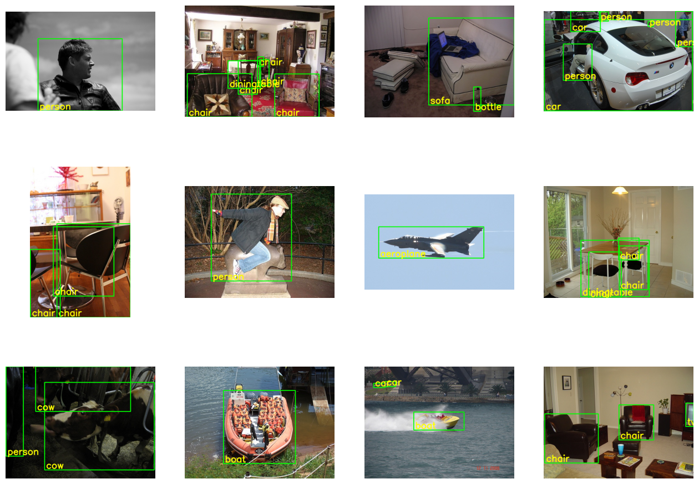

# 3-1. Object detection: VOCDetection: FasterRCNN (Obsolete)

We aim to detect objects consisting of 20 classes: person, bird, cat, dog, horse, sheep, aeroplane, bicycle, boat,
bicycle, boat, bus, car, motorbike, train, bottle, chair, dining table, potted plant, sofa, and TV monitor. Pascal VOC
Detection Dataset (http://host.robots.ox.ac.uk/pascal/VOC/) and Faster RCNN with MobileNetV3
backbone (https://towardsdatascience.com/faster-r-cnn-for-object-detection-a-technical-summary-474c5b857b46) are
employed for the trial. The code is modified form https://pytorch.org/tutorials/intermediate/torchvision_tutorial.html.

<br />

### 1. Model Setup
```python
from torchvision.models.detection.faster_rcnn import FastRCNNPredictor

pretrain_weight = torchvision.models.detection.FasterRCNN_MobileNet_V3_Large_320_FPN_Weights

# default num_classes = 91 from the pretrained model (COCO)
model_ft = torchvision.models.detection.fasterrcnn_mobilenet_v3_large_320_fpn(weights = pretrain_weight)

# output layer with embedding vector of 1024 & #output classes = 21
model_ft.roi_heads.box_predictor = FastRCNNPredictor(1024, 21) #1

net = model_ft.to(device)
```

Sets up a Faster R-CNN model with a MobileNet V3 backbone, pretrained on the COCO dataset.

<br />

### 2. Data Preparation and Inspection
```python
import albumentations as A
from albumentations.pytorch import ToTensorV2

transform_train = transforms.Compose(
    [#transforms.Resize((230,230)),
        transforms.ToTensor(),
        transforms.Normalize(mean=[0.5, 0.5, 0.5], std=[0.5, 0.5, 0.5])
    ])

transform = transforms.Compose(
    [#transforms.Resize((230,230)),
        transforms.ToTensor(),
        transforms.Normalize(mean=[0.5, 0.5, 0.5], std=[0.5, 0.5, 0.5])
    ])

batch_size = 32
```
Defines transformations for training and testing datasets using PyTorch's transforms.

<br />


```python
class_ = ["person", "bird", "cat", "cow", "dog",
          "horse", "sheep", "aeroplane", "bicycle", "boat",
          "bus", "car", "motorbike", "train", "bottle",
          "chair", "diningtable", "pottedplant", "sofa", "tvmonitor"]

textlabel2num = {x: i+1 for i, x in enumerate( class_)}
numlabel2text = {i+1: x for i, x in enumerate( class_)}
textlabel2num
```
Creates two mappings: one from object class names to numeric labels (`textlabel2num`), and one from numeric labels back to class names (`numlabel2text`)

<br />

```python
import numpy as np

class MyDataset(torch.utils.data.Dataset):
    def __init__(self, dataset):
        self.dataset = dataset

    def __len__(self):
        return self.dataset.__len__()

    def __getitem__(self, idx):
        X, y = self.dataset.__getitem__(idx)

        labels = []
        boxes = []
        for item in y['annotation']['object']:
            labels.append(textlabel2num[item['name']])
            box = item['bndbox']
            boxes.append([np.float32(box["xmin"]),
                          np.float32(box["ymin"]),
                          np.float32(box["xmax"]),
                          np.float32(box["ymax"])])

        labels = torch.as_tensor(labels, dtype=torch.int64).to(device)
        boxes = torch.as_tensor(boxes, dtype=torch.float32).to(device)
        X = X.to(device)

        target = {}
        target["boxes"] = boxes
        target["labels"] = labels

        return X, target
```
Defines a custom dataset class for the Pascal VOC dataset, which returns images and their corresponding bounding boxes and labels.

<br />

```python
# Create training, validation, testing loader
trainset = torchvision.datasets.VOCDetection(root='./data', year='2007', image_set='train', download=True, transform=transform_train)
trainset = MyDataset(trainset)
trainloader = torch.utils.data.DataLoader(trainset, batch_size=batch_size, shuffle=True, collate_fn=collate_fn)

valtestset = torchvision.datasets.VOCDetection(root='./data', year='2007', image_set='val', download=True, transform=transform)
valtestset = MyDataset(valtestset)
valset, testset = torch.utils.data.random_split(valtestset, [2510//2, 2510//2])#, generator=torch.Generator().manual_seed(2023))

valloader = torch.utils.data.DataLoader(valset, batch_size=batch_size, shuffle=False, collate_fn=collate_fn)
testloader = torch.utils.data.DataLoader(testset, batch_size=batch_size, shuffle=False, collate_fn=collate_fn)
```
Creates data loaders for training, validation, and testing using the Pascal VOC dataset by following process:
- **Dataset Loading**: Downloads and loads the Pascal VOC 2007 dataset for the training split.
- **Custom Dataset**: Converts the dataset into a custom dataset class for compatibility with PyTorch.
- **DataLoader for Training**: Creates a data loader for the training set.

<br />

```python
import matplotlib.pyplot as plt
import numpy as np
import cv2

# functions to show an image
def imshow(imgs, labels, ncol):
    nrow = len(imgs) // ncol

    fig, ax = plt.subplots(nrow, ncol, figsize=(ncol*4, nrow*4))
    for row in range(nrow):
        for col in range(ncol):
            if row*ncol + col < len(imgs):
                img = imgs[row*ncol + col].cpu()*0.5 + 0.5
                img = img.permute((1, 2, 0)).mul(255).numpy()
                img = np.ascontiguousarray(img, dtype=np.uint8)

                boxes = labels[row*ncol + col]['boxes'].cpu().numpy()
                in_labels = labels[row*ncol + col]['labels'].cpu().numpy()
                nbox, _ = boxes.shape

                for i in range(nbox):
                    img = cv2.rectangle(img = img,
                                        pt1 = (int(boxes[i][0]), int(boxes[i][1])),
                                        pt2 = (int(boxes[i][2]), int(boxes[i][3])),
                                        color = (0, 255, 0),
                                        thickness = 2)

                    img = cv2.putText(img = img,
                                      text = f'{numlabel2text[in_labels[i]]}',
                                      org = (int(boxes[i][0]) + 5, int(boxes[i][3]) - 5 ),
                                      fontFace = cv2.FONT_HERSHEY_SIMPLEX,
                                      fontScale = 1,
                                      color = (255, 255, 0),
                                      thickness = 2,
                                      lineType = cv2.LINE_AA)

                ax[row, col].imshow(img)
                ax[row, col].axis('off')
            else:
                ax[row, col].imshow(np.zeros((200,200, 3), dtype = np.uint8))
                ax[row, col].axis('off')
    plt.show()

# get some random training images
dataiter = iter(trainloader)
images, labels = next(dataiter)

# show images
ncol = 4
imshow(images[:13], labels[:13], ncol)
```
Visualizes the training images with their bounding boxes and labels.



<br />

### 3. Training and Validation

```python
# CAUTION: TRAIN 2 HOUR!! 30 epochs
# CAUTION: TRAIN 40 MINUTES!! 10 epochs
# CAUTION: TRAIN 20 MINUTES!! 5 epochs
from tqdm.notebook import tqdm

epochs = 5
history_train = {'loss_classifier':np.zeros(epochs),'loss_box_reg':np.zeros(epochs),'loss_objectness':np.zeros(epochs),'loss_rpn_box_reg':np.zeros(epochs), 'iou':np.zeros(epochs), 'ap@50':np.zeros(epochs)}
history_val = {'loss_classifier':np.zeros(epochs),'loss_box_reg':np.zeros(epochs),'loss_objectness':np.zeros(epochs),'loss_rpn_box_reg':np.zeros(epochs), 'iou':np.zeros(epochs), 'ap@50':np.zeros(epochs)}
max_val_iou = 0
PATH = './VOCDetection-FasterRCNN_MobileNet_V3.pth'

for epoch in range(epochs):  # loop over the dataset multiple times

    print(f'epoch {epoch + 1} \nTraining ...')
    mIoU = 0
    training_loss = 0.0
    training_loss_classifier = 0.0
    training_loss_box_reg = 0.0
    training_loss_objectness = 0.0
    training_loss_rpn_box_reg = 0.0
    n = 0
    with torch.set_grad_enabled(True):
        for data in tqdm(trainloader):
            # get the inputs; data is a list of [inputs, labels]
            inputs, labels = data

            # zero the parameter gradients
            optimizer.zero_grad()

            # forward
            net.train()
            loss_dict = net(inputs, labels)
            loss = sum(x for x in loss_dict.values())

            #backward
            loss.backward()

            #optimize
            optimizer.step()

            # find mIoU
            with torch.no_grad():
                net.eval()
                preds = net(inputs)
                mIoU_sample, n_sample = miou(preds, labels)

            # aggregate statistics
            training_loss += loss.item()*n_sample
            training_loss_classifier += loss_dict['loss_classifier'].item()*n_sample
            training_loss_box_reg += loss_dict['loss_box_reg'].item()*n_sample
            training_loss_objectness += loss_dict['loss_objectness'].item()*n_sample
            training_loss_rpn_box_reg += loss_dict['loss_rpn_box_reg'].item()*n_sample
            mIoU += mIoU_sample*n_sample
            n += n_sample

    scheduler.step()

    # print statistics
    training_loss /= n
    training_loss_classifier /= n
    training_loss_box_reg /= n
    training_loss_objectness /= n
    training_loss_rpn_box_reg /= n
    mIoU /= n
    print(f"total_training loss: {training_loss:.4}, loss_classifier: {training_loss_classifier:.4}, loss_box_reg: {training_loss_box_reg:.4}, loss_objectness: {training_loss_objectness:.4}, loss_rpn_box_reg: {training_loss_rpn_box_reg:.4}, mIoU: {mIoU:.4}" )
    history_train['loss_classifier'][epoch] = training_loss_classifier
    history_train['loss_box_reg'][epoch] = training_loss_box_reg
    history_train['loss_objectness'][epoch] = training_loss_objectness
    history_train['loss_rpn_box_reg'][epoch] = training_loss_rpn_box_reg
    history_train['iou'][epoch] = mIoU

    print('validating ...')
    mIoU = 0
    validation_loss = 0.0
    validation_loss_classifier = 0.0
    validation_loss_box_reg = 0.0
    validation_loss_objectness = 0.0
    validation_loss_rpn_box_reg = 0.0
    n = 0
    with torch.no_grad():
        for data in tqdm(valloader):
            inputs, labels = data

            # find mIoU
            net.eval()
            preds = net(inputs)
            mIoU_sample, n_sample = miou(preds, labels)

            # loss
            net.train()
            loss_dict = net(inputs, labels)
            loss = sum(x for x in loss_dict.values())

            # zero the parameter gradients
            optimizer.zero_grad()

            # aggregate statistics
            validation_loss += loss.item()*n_sample
            validation_loss_classifier += loss_dict['loss_classifier'].item()*n_sample
            validation_loss_box_reg += loss_dict['loss_box_reg'].item()*n_sample
            validation_loss_objectness += loss_dict['loss_objectness'].item()*n_sample
            validation_loss_rpn_box_reg += loss_dict['loss_rpn_box_reg'].item()*n_sample
            mIoU += mIoU_sample*n_sample
            n += n_sample

    # print statistics
    validation_loss /= n
    validation_loss_classifier /= n
    validation_loss_box_reg /= n
    validation_loss_objectness /= n
    validation_loss_rpn_box_reg /= n
    mIoU /= n
    print(f"total_validation loss: {validation_loss:.4}, loss_classifier: {validation_loss_classifier:.4}, loss_box_reg: {validation_loss_box_reg:.4}, loss_objectness: {validation_loss_objectness:.4}, loss_rpn_box_reg: {validation_loss_rpn_box_reg:.4}, mIoU: {mIoU:.4}" )
    history_val['loss_classifier'][epoch] = validation_loss_classifier
    history_val['loss_box_reg'][epoch] = validation_loss_box_reg
    history_val['loss_objectness'][epoch] = validation_loss_objectness
    history_val['loss_rpn_box_reg'][epoch] = validation_loss_rpn_box_reg
    history_val['iou'][epoch] = mIoU

    #save min validation loss
    if mIoU > max_val_iou:
        torch.save(net.state_dict(), PATH)
        max_val_iou = mIoU

print('Finished Training')
```
Trains the Faster R-CNN model on the Pascal VOC dataset for a specified number of epochs, and validates the model after each epoch.

<br />

### 4. Testing (evaluation)

```python
from tqdm.notebook import tqdm
print('testing ...')
mIoU = 0
validation_loss = 0.0
validation_loss_classifier = 0.0
validation_loss_box_reg = 0.0
validation_loss_objectness = 0.0
validation_loss_rpn_box_reg = 0.0
n = 0
with torch.no_grad():
  for data in tqdm(valloader):
      inputs, labels = data

      # find mIoU
      net.eval()
      preds = net(inputs)
      mIoU_sample, n_sample = miou(preds, labels)

      # loss
      net.train()
      loss_dict = net(inputs, labels)
      loss = sum(x for x in loss_dict.values())

      # zero the parameter gradients
      optimizer.zero_grad()

      # aggregate statistics
      validation_loss += loss.item()*n_sample
      validation_loss_classifier += loss_dict['loss_classifier'].item()*n_sample
      validation_loss_box_reg += loss_dict['loss_box_reg'].item()*n_sample
      validation_loss_objectness += loss_dict['loss_objectness'].item()*n_sample
      validation_loss_rpn_box_reg += loss_dict['loss_rpn_box_reg'].item()*n_sample
      mIoU += mIoU_sample*n_sample
      n += n_sample

# print statistics
validation_loss /= n
validation_loss_classifier /= n
validation_loss_box_reg /= n
validation_loss_objectness /= n
validation_loss_rpn_box_reg /= n
mIoU /= n
print(f"total_testing loss: {validation_loss:.4}, loss_classifier: {validation_loss_classifier:.4}, loss_box_reg: {validation_loss_box_reg:.4}, loss_objectness: {validation_loss_objectness:.4}, loss_rpn_box_reg: {validation_loss_rpn_box_reg:.4}, mIoU: {mIoU:.4}" )
```
Tests the Faster R-CNN model on the validation set of the Pascal VOC dataset.

<br />

### 5. Performance on training set

```python
def imshow_test(imgs, preds, labels, ncol):
    nrow = len(imgs) // ncol

    fig, ax = plt.subplots(nrow, ncol, figsize=(ncol*10, nrow*10))
    for row in range(nrow):
        for col in range(ncol):
            if row*ncol + col < len(imgs):
                img = imgs[row*ncol + col].cpu()*0.5 + 0.5
                img = img.permute((1, 2, 0)).mul(255).numpy()
                img = np.ascontiguousarray(img, dtype=np.uint8)

                boxes = labels[row*ncol + col]['boxes'].cpu().numpy()
                in_labels = labels[row*ncol + col]['labels'].cpu().numpy()
                nbox, _ = boxes.shape

                for i in range(nbox):
                    img = cv2.rectangle(img = img,
                                        pt1 = (int(boxes[i][0]), int(boxes[i][1])),
                                        pt2 = (int(boxes[i][2]), int(boxes[i][3])),
                                        color = (0, 255, 0),
                                        thickness = 2)

                    img = cv2.putText(img = img,
                                      text = f'{numlabel2text[in_labels[i]]}',
                                      org = (int(boxes[i][0]) + 5, int(boxes[i][3]) - 5 ),
                                      fontFace = cv2.FONT_HERSHEY_SIMPLEX,
                                      fontScale = 1,
                                      color = (255, 255, 0),
                                      thickness = 2,
                                      lineType = cv2.LINE_AA)

                boxes = preds[row*ncol + col]['boxes'].cpu().numpy()
                in_labels = preds[row*ncol + col]['labels'].cpu().numpy()
                confident = preds[row*ncol + col]['scores'].cpu().numpy()
                nbox, _ = boxes.shape

                for i in range(nbox):
                    if confident[i] > 0.5:
                        img = cv2.rectangle(img = img,
                                            pt1 = (int(boxes[i][0]), int(boxes[i][1])),
                                            pt2 = (int(boxes[i][2]), int(boxes[i][3])),
                                            color = (255, 0, 0),
                                            thickness = 2)

                        img = cv2.putText(img = img,
                                          text = f'{numlabel2text[in_labels[i]]}',
                                          org = (int(boxes[i][0]) + 5, int(boxes[i][3]) - 5 ),
                                          fontFace = cv2.FONT_HERSHEY_SIMPLEX,
                                          fontScale = 1,
                                          color = (255, 0, 0),
                                          thickness = 2,
                                          lineType = cv2.LINE_AA)

                ax[row, col].imshow(img)
                ax[row, col].axis('off')
            else:
                ax[row, col].imshow(np.zeros((200,200, 3), dtype = np.uint8))
                ax[row, col].axis('off')
    plt.show()
```
Defines a function to visualize the predictions of the Faster R-CNN model on the training set.

<br />

```python
dataiter = iter(trainloader)
images, labels = next(dataiter)
with torch.no_grad():
    net.eval()
    preds = net(images)

# show images
ncol = 4
imshow_test(images[:13], preds[:13], labels[:13], ncol)
```
Visualizes the predictions of the Faster R-CNN model on the training set.


<br />

### 6. Performance on validation set

```python
dataiter = iter(valloader)
images, labels = next(dataiter)
with torch.no_grad():
    net.eval()
    preds = net(images)

# show images
ncol = 3
imshow_test(images[:9], preds[:9], labels[:9], ncol)
```
Visualizes the predictions of the Faster R-CNN model on the validation set.


<br />

### 7. Performance on test set

```python
dataiter = iter(testloader)
images, labels = next(dataiter)
with torch.no_grad():
    net.eval()
    preds = net(images)

# show images
ncol = 3
imshow_test(images[:9], preds[:9], labels[:9], ncol)
```
Retrieves a batch from the test loader, runs the model in evaluation mode to get predictions, and then displays the first 9 images along with their predicted and actual labels in a 3x3 grid

```python
dataiter = iter(testloader)
images, labels = next(dataiter)
with torch.no_grad():
    net.eval()
    preds = net(images)

# show images
ncol = 3
imshow_test(images[:9], preds[:9], labels[:9], ncol)
```
Visualizes the predictions of the Faster R-CNN model on the test set.


<br />

### 8. Performance on testing set with finished weight

```python
net.load_state_dict(torch.load('./VOCDetection-FasterRCNN_MobileNet_V3_master.pth', map_location=torch.device('cpu')))
```
Loads pre-trained weights from the file `VOCDetection-FasterRCNN_MobileNet_V3_master.pth` into the model (`net`)

```python
import matplotlib.pyplot as plt
import cv2
dataiter = iter(testloader)
images, labels = next(dataiter)
images, labels = next(dataiter)
with torch.no_grad():
    net.eval()
    preds = net(images)

# show images
ncol = 3
imshow_test(images[:9], preds[:9], labels[:9], ncol)
```
Retrieves a batch of test images and labels from the test data loader and runs the model in evaluation mode to generate predictions. After that, it displays the first 9 images from the batch, along with their predicted and actual labels.


---

### **Steps Overview**

1. Model Setup
2. Data Preparation and Inspection
3. Training and Validation
4. Testing (evaluation)
5. performance on training set
6. performance on validation set
7. performance on test set
8. performance on testing set with finished weight

### **Intensive Summary**

The project implements object detection using Faster R-CNN with a MobileNet V3 backbone, pre-trained on the COCO
dataset.
The model was fine-tuned to detect 20 classes for the Pascal VOC dataset.

### **Results**

The model is customized for Pascal VOC object detection, using pretrained COCO weights for improved training efficiency.
It is ready for further training or inference, with support for CUDA acceleration. The data processing pipeline ensures
that the model performs well on object detection tasks with consistent and efficient results.

<br />

References:\
https://colab.research.google.com/github/pvateekul/2110531_DSDE_2024s1/blob/main/code/Week04_DL/3_1_Object_detection_VOCDetection_FasterRCNN_MobileNet_V3.ipynb
