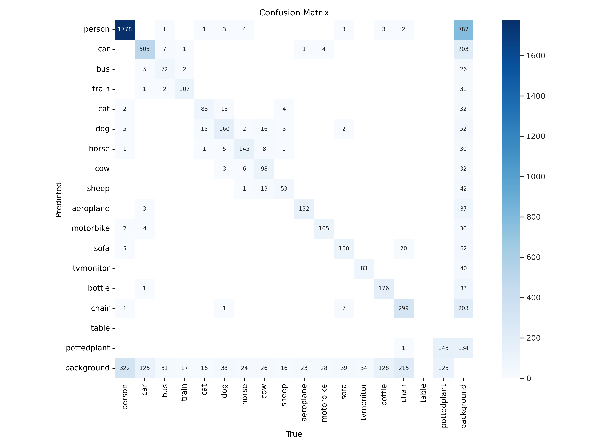
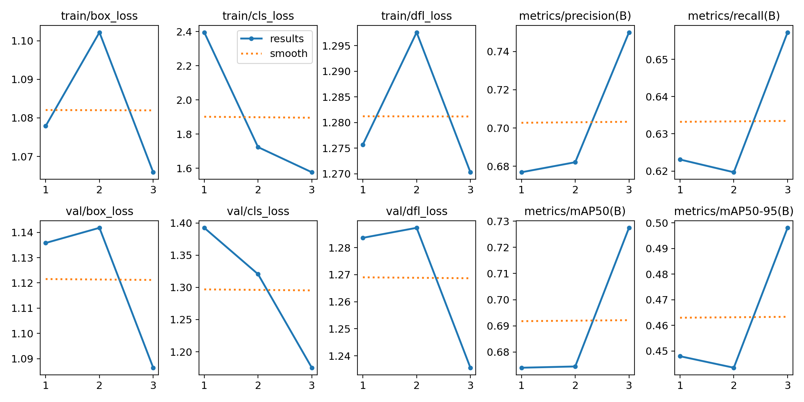

# 3-3. Object detection: VOCDetection (advanced): YOLOv8 (custom dataset)

We aim to detect objects consisting of 20 classes: person, bird, cat, dog, horse, sheep, aeroplane, bicycle, boat,
bicycle, boat, bus, car, motorbike, train, bottle, chair, dining table, potted plant, sofa, and TV monitor. Pascal VOC
Detection Dataset (http://host.robots.ox.ac.uk/pascal/VOC/) and
YOLOv8 (https://docs.ultralytics.com/datasets/detect/voc/) are employed for the trial. The code is modified
form https://colab.research.google.com/github/ultralytics/ultralytics/blob/main/examples/tutorial.ipynb.

<br />

### 1. Download the Pascal VOC dataset.

```python
def download_file(url, dest_folder):
    if not os.path.exists(dest_folder):
        os.makedirs(dest_folder)

    filename = os.path.join(dest_folder, url.split('/')[-1])

    if os.path.isfile(filename):
        print(f"{filename} already exists. Skipping download.")
        return filename

    response = requests.get(url, stream=True)
    total_size = int(response.headers.get('content-length', 0))

    with open(filename, 'wb') as f, tqdm(
        desc=filename,
        total=total_size,
        unit='iB',
        unit_scale=True,
        unit_divisor=1024,
    ) as bar:
        for chunk in response.iter_content(chunk_size=1024):
            if chunk:
                f.write(chunk)
                bar.update(len(chunk))

    return filename

def extract_tar(tar_file, extract_to_folder):
    with tarfile.open(tar_file, 'r') as tar_ref:
        tar_ref.extractall(extract_to_folder)
```

`download_file(url, dest_folder)`: downloads a file from a given URL and saves it to the specified destination folder. \
`extract_tar(tar_file, extract_to_folder)`: extracts the contents of a `.tar` file to the specified folder.

<br />

### 2. Prepare Data for YOLOv8 Model

```python
# Download and extract VOC 2007
base_url = "http://host.robots.ox.ac.uk:8080/pascal/VOC/voc2007/"
files = {
    'VOCtrainval_06-Nov-2007.tar': 'VOCtrainval_06-Nov-2007.tar',
    'VOCtest_06-Nov-2007.tar': 'VOCtest_06-Nov-2007.tar'
}

download_folder = '/content/voc2007'
for url, filename in files.items():
    print(f"Downloading {filename}...")
    tar_path = download_file(base_url + filename, download_folder)
    print(f"Extracting {filename}...")
    extract_tar(tar_path, download_folder)
    print(f"{filename} extracted.")
```

Downloading and extracting the Pascal VOC 2007 dataset from the given URL

<br />

```python
# Define your class names (must match your dataset)
class_names = ["person", "car", "bus", "train", "cat", "dog", "horse", "cow", "sheep", "aeroplane", "motorbike", "sofa", "tvmonitor", "bottle", "chair", "table", "pottedplant"]

voc_annot_folder = '/content/voc2007/VOCdevkit/VOC2007/Annotations'
image_folder = '/content/voc2007/VOCdevkit/VOC2007/JPEGImages'
yolo_annot_folder = '/content/yolo_annotations'
```

Defining the class names and the paths to the VOC dataset annotations, images, and YOLO annotations.

<br />

```python
os.makedirs(yolo_annot_folder,exist_ok=True)
os.makedirs(os.path.join(yolo_annot_folder,"images"),exist_ok=True)
os.makedirs(os.path.join(yolo_annot_folder,"labels"),exist_ok=True)
# Create lists for images
image_paths = glob(os.path.join(image_folder, "*.jpg"))
image_filenames = [os.path.basename(path) for path in image_paths]

# Process training and validation annotations
train_annot_folder = os.path.join(yolo_annot_folder, "labels", 'train')
val_annot_folder = os.path.join(yolo_annot_folder, "labels" ,'val')

os.makedirs(train_annot_folder,exist_ok=True)
os.makedirs(val_annot_folder,exist_ok=True)
```

Creating directories for YOLO annotations and images, and defining the paths for training and validation annotations.

<br />

```python
# Helper function to process annotations
def process_annotations(file_list, annot_folder):
    for image_filename in file_list:
        xml_file = os.path.join(voc_annot_folder, os.path.splitext(image_filename)[0] + '.xml')
        if not os.path.isfile(xml_file):
            continue

        tree = ET.parse(xml_file)
        root = tree.getroot()

        # Get image size
        image_path = os.path.join(image_folder, image_filename)
        image = cv2.imread(image_path)
        h, w, _ = image.shape

        yolo_annot_file = os.path.join(annot_folder, os.path.splitext(image_filename)[0] + '.txt')
        with open(yolo_annot_file, 'w') as f:
            for obj in root.findall('object'):
                cls = obj.find('name').text
                if cls not in class_names:
                    continue
                cls_id = class_names.index(cls)

                xml_box = obj.find('bndbox')
                b = [int(xml_box.find('xmin').text), int(xml_box.find('ymin').text), int(xml_box.find('xmax').text), int(xml_box.find('ymax').text)]

                # Convert to YOLO format
                x_center = (b[0] + b[2]) / 2.0 / w
                y_center = (b[1] + b[3]) / 2.0 / h
                width = (b[2] - b[0]) / w
                height = (b[3] - b[1]) / h

                f.write(f"{cls_id} {x_center} {y_center} {width} {height}\n")
```

`process_annotations`:  converts Pascal VOC annotations into YOLO format

<br />

```python
# Split dataset into training and validation
train_files, val_files = train_test_split(image_filenames, test_size=0.2, random_state=42)
```

Splitting the dataset into training and validation sets.

<br />

```python
process_annotations(train_files, train_annot_folder)
process_annotations(val_files, val_annot_folder)
```

Processing the training and validation annotations.

<br />

```python
# Copy images to respective folders
train_img_folder = os.path.join(yolo_annot_folder, "images", 'train')
val_img_folder = os.path.join(yolo_annot_folder, "images" ,'val')

os.makedirs(train_img_folder,exist_ok=True)
os.makedirs(val_img_folder,exist_ok=True)

for f in train_files:
    shutil.copy(os.path.join(image_folder, f), os.path.join(train_img_folder, f))

for f in val_files:
    shutil.copy(os.path.join(image_folder, f), os.path.join(val_img_folder, f))
```

Copying images to the respective training and validation folders.

<br />

```python
# Create data.yaml file
yaml_content = """
train: /content/yolo_annotations/images/train
val: /content/yolo_annotations/images/val

nc: 17  # Number of classes (change this if your class list differs)
names: ['person', 'car', 'bus', 'train', 'cat', 'dog', 'horse', 'cow', 'sheep', 'aeroplane', 'motorbike', 'sofa', 'tvmonitor', 'bottle', 'chair', 'table', 'pottedplant']
"""

with open('/content/data.yaml', 'w') as f:
    f.write(yaml_content)
```

Creating the `data.yaml` file with the training and validation image paths, number of classes, and class names.

<br />

### 3. Training YOLOv8 Model

```python
from ultralytics import YOLO

# Load a model
# model = YOLO('yolov8n.yaml')  # build a new model from scratch
model = YOLO('yolov8n.pt')  # load a pretrained model (recommended for training)
model.to('cuda:0') # set up the model to GPU
# Use the model
results = model.train(data='data.yaml', epochs=3)  # train the model
```

loads a pretrained YOLOv8 model, and trains it on a custom dataset defined in `data.yaml` for 3 epochs.

<br />

### 4. Evaluate the Model

```python
Image.open("/content/runs/detect/train/confusion_matrix.png")
```

This is the file path to the confusion matrix image. The confusion matrix visually represents the performance of the
model, showing true positives, false positives, and false negatives for each class.



<br />

```python
Image.open("/content/runs/detect/train/results.png")
```

A set of training and validation metrics visualized as line graphs for a YOLOv8 model. These metrics help track the
performance of the model during and after training across 3 epochs.



<br />

```python
Image.open("/content/runs/detect/train/val_batch1_pred.jpg")
```

Displays the results of object detection using a trained YOLO model. Each image in the grid contains bounding boxes
around detected objects, along with labels and confidence scores


---

### Steps Overview

1. Download Pascal VOC Dataset
2. Prepare Data for YOLOv8 Model
3. Training YOLOv8 Model
4. Evaluate the Model

### Intensive Summary

Object detection using YOLOv8 with the Pascal VOC dataset. It involves setting up the environment, downloading the
dataset, training the model, and evaluating its performance.

### Results

The model's performance is measured through the mAP score, which reflects its detection accuracy. YOLOv8 is optimized
for real-time detection.

<br />

References:\
https://colab.research.google.com/github/pvateekul/2110531_DSDE_2024s1/blob/main/code/Week04_DL/3_3_Object_detection_VOCDetection_yolov8_advanced.ipynb
