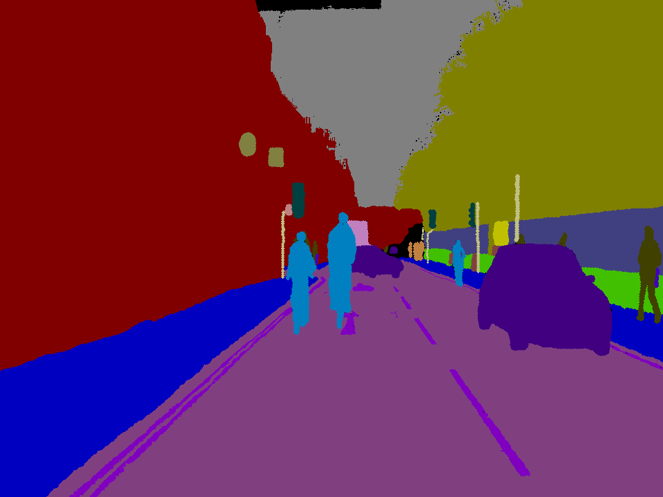
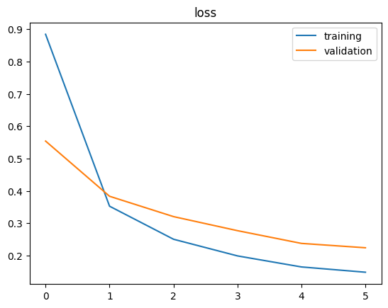
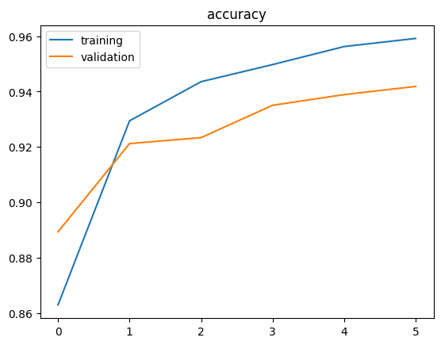
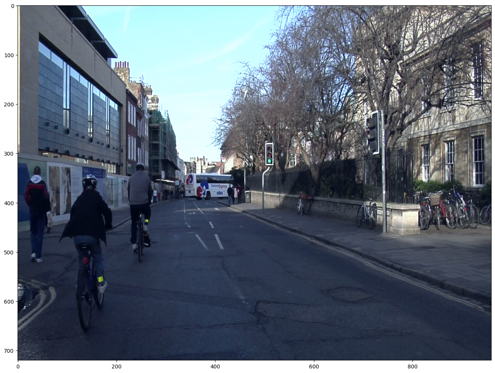
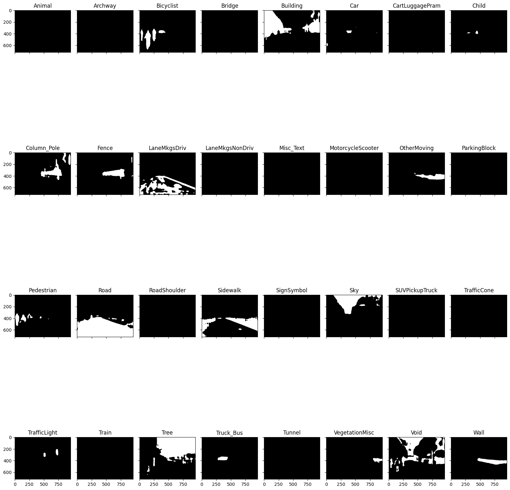
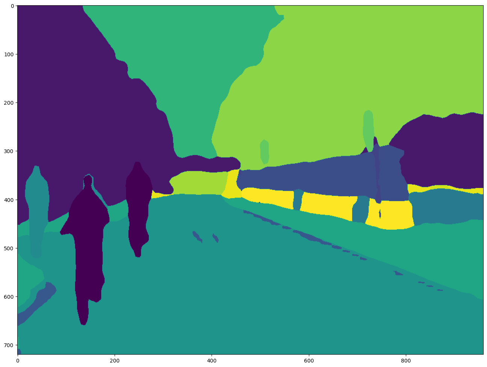
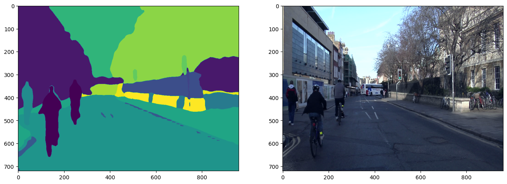

# 4. Semantic segmentation: CamSeq2007

Image segmentation with pytorch?

In an image classification task the network assigns a label (or class) to each input image. However, suppose you want to
know the shape of that object, which pixel belongs to which object, etc. In this case you will want to assign a class to
each pixel of the image. This task is known as segmentation. A segmentation model returns much more detailed intofmation
about the image. Image segmentation has many applications in medical imaging, self-driving cars and satellite imaging to
name a few.

### 1. Load the CamSeq dataset

```python
# download the dataset from kaggle link above or use this script
! wget https://github.com/pvateekul/2110531_DSDE_2023s1/raw/main/code/Week05_Intro_Deep_Learning/data/Camseq_2007.zip
```

download the dataset from kaggle link above or use this script

```python
# input image
img = Image.open('./Camseq_2007/0016E5_07961.png')
img
```

Show the input image


```python
# input mask
img = Image.open('./Camseq_2007/0016E5_07961_L.png')
img
```

Show the input mask which is typically an image where each pixel value corresponds to a particular class or object
label. The mask serves as the ground truth for the segmentation model, telling it which pixels belong to which objects
in the scene.



```python
# load colormap from label_colors.txt
colormap = OrderedDict()
with open("./Camseq_2007/label_colors.txt",'r') as f:
    for line in f:
        r,g,b,cls = line.split()
        colormap[cls] = [int(e) for e in [r,g,b]]
list(islice(colormap.items(),8))
```

load colormap from label_colors.txt

<br />

### 2. Create a PyTorch dataset for semantic segmentation

```python
class CamSeqDataset(Dataset):

    def __init__(self,
                 img_dir,
                 colormap=colormap,
                 transforms=None):

        super().__init__()
        # sort order of frame from video sequence
        self.images = sorted([os.path.join(img_dir, e)
                              for e in os.listdir(img_dir)
                              if not e.split('.')[0].endswith('_L')])
        # remove text files
        self.images = [e for e in self.images if not e.endswith('.txt')]
        self.masks = sorted([os.path.join(img_dir, e)
                              for e in os.listdir(img_dir)
                              if e.split('.')[0].endswith('_L')])
        self.colormap = colormap
        self.num_classes = len(self.colormap) # 32 classes
        self.transforms = transforms

    def __len__(self):
        return len(self.images)

    def __getitem__(self, idx):

        img = Image.open(self.images[idx])
        mask = Image.open(self.masks[idx])

        if img.mode != 'RGB':
            img = img.convert('RGB')
        if mask.mode != 'RGB':
            mask = mask.convert('RGB')

        img = np.asarray(img) # change from image to array
        mask = np.asarray(mask)
        mask_channels = np.zeros(
            (mask.shape[0], mask.shape[1]), dtype=np.int64)

        # convert RGB mask to class-pixel mask ; (R,G,B) -> (Class)
        for i, cls in enumerate(self.colormap.keys()):
            color = self.colormap[cls]
            sub_mask = np.all(mask==color, axis=-1)*i
            mask_channels += sub_mask #*i

        # transforms such as normalization
        if self.transforms is not None:
            transformed = self.transforms(image=img, masks=mask_channels)
            img = transformed['image']
            mask_channels = transformed['masks']

        mask_channels = mask_channels.astype(np.float32)
        img = img.astype(np.float32) #/255

        instance = {'image': torch.from_numpy(img.transpose(2,0,1)),
                    'mask': torch.from_numpy(mask_channels)}

        return instance

    def ___first__(self):
        return self.__getitem__[0]
```

The `CamSeqDataset` class is a PyTorch dataset for semantic segmentation tasks using the CamSeq dataset. It loads images
and corresponding masks, converts the masks from RGB values to class labels using a colormap, and applies optional
transformations (like normalization)

<br />

```python
# simple transform (using ImageNet norm and std) "Albumentation == torchvision.transforms for segmentation"
transform = A.Normalize(mean=(0.485, 0.456, 0.406), std=(0.229, 0.224, 0.225))
```

Provided transformation uses Albumentations to normalize images for segmentation tasks.

<br />

### 3. Split the dataset into training, validation, and test sets

```python
dataset = CamSeqDataset(img_dir='./Camseq_2007', colormap=colormap,transforms=transform)
# we split train/val/test -> 70/15/15
train_size = int(len(dataset)*0.7)
val_size = (len(dataset)-train_size)//2
# train_set, rest = random_split(dataset, [train_size, len(dataset)-train_size])
# val_set, test_set = random_split(rest, [val_size, len(rest)-val_size])
# We do not use random split because the dataset is extracted from a video sequence, so nearly every frame looks the same.
train_set = Subset(dataset, range(train_size))
val_set = Subset(dataset, range(train_size, train_size + val_size))
test_set = Subset(dataset, range(train_size + val_size, len(dataset)))
```

The dataset is split into training, validation, and test sets in a **70/15/15** ratio. Instead of using `random_split`,
the dataset is split sequentially to maintain the temporal order. `train_set`, `val_set`, and `test_set` are created
using the `Subset` method, ensuring that each split contains different portions of the dataset without randomization.

<br />

```python
batch_size = 2

train_loader = DataLoader(train_set, batch_size=batch_size, shuffle=True)
val_loader = DataLoader(val_set, batch_size=batch_size, shuffle=True)
test_loader = DataLoader(test_set, batch_size=batch_size, shuffle=True)
```

The dataset is loaded into PyTorch `DataLoader` objects for training, validation, and testing with a batch size of 2

<br />

### 4. Create a DeepLabv3 model
```python
def create_model(out_channels=32):
    model = torchvision.models.segmentation.deeplabv3_resnet50(pretrained=True)
    # decoder head
    model.classifier = torchvision.models.segmentation.deeplabv3.DeepLabHead(
        2048, num_classes=out_channels)

    model.train()
    return model
```

The `create_model` function creates a **DeepLabv3 model** based on a **ResNet-50 backbone** pre-trained on ImageNet

<br />

### 5. Train the model
```python
def train_model(model,
                train_loader,
                val_loader,
                criterion= nn.CrossEntropyLoss(),
                num_epochs=1,
                device=torch.device('cpu'),
                lr=0.0002,
                model_path="./model.pth"
                ):

    model.to(device)
    optimizer = optim.Adam(model.parameters(), lr=lr)
    scheduler = lr_scheduler.StepLR(optimizer, step_size=4, gamma=0.5)
    metrics = {
          "train_losses" : [],
          "val_losses" : [],
          "train_acc" : [],
          "val_acc" : []
          }
    min_val_loss = 1e10
    for epoch in range(1, num_epochs + 1):
        tr_loss = []
        val_loss = []
        tr_acc = []
        val_acc = []
        model.train()
        print('Epoch {}/{}'.format(epoch, num_epochs))
        for sample in tqdm(train_loader):
            if sample['image'].shape[0]==1:
                break
            inputs = sample['image'].to(device)
            masks = sample['mask'].to(device)

            optimizer.zero_grad()
            outputs = model(inputs)
            y_pred = outputs['out']
            y_true = masks
            loss = criterion(y_pred.float(), y_true.long())
            acc = (torch.argmax(y_pred, 1) == y_true).float().mean()
            loss.backward()
            tr_loss.append(loss)
            tr_acc.append(acc)
            optimizer.step()
        scheduler.step()
        optimizer.zero_grad()
        avg_tr_loss = torch.mean(torch.Tensor(tr_loss))
        metrics["train_losses"].append(avg_tr_loss)
        avg_tr_acc = torch.mean(torch.Tensor(tr_acc))
        metrics["train_acc"].append(avg_tr_acc)
        print(f'Train loss: {avg_tr_loss}')
        print(f'Train acc: {avg_tr_acc}')

        # Validation phrase
        for sample in tqdm(val_loader):
            if sample['image'].shape[0]==1:
                break
            inputs = sample['image'].to(device)
            masks = sample['mask'].to(device)
            model.eval()
            with torch.no_grad():
                outputs = model(inputs)
            y_pred = outputs['out']
            y_true = masks
            loss = criterion(y_pred.float(), y_true.long())
            # acc using pixel accuracy. (it is easy to understand,but no way the best metric)
            # learn more https://towardsdatascience.com/metrics-to-evaluate-your-semantic-segmentation-model-6bcb99639aa2
            acc = (torch.argmax(y_pred, 1) == y_true).float().mean()
            val_loss.append(loss)
            val_acc.append(acc)
        avg_val_loss = torch.mean(torch.Tensor(val_loss))
        metrics["val_losses"].append(avg_val_loss)
        avg_val_acc = torch.mean(torch.Tensor(val_acc))
        metrics["val_acc"].append(avg_val_acc)
        print(f'val loss: {avg_val_loss}')
        print(f'val acc: {avg_val_acc}')
        # save model state that have best val loss
        if avg_val_loss < min_val_loss:
            torch.save(model.state_dict(), model_path)
            min_val_loss = avg_val_loss
    return model,metrics
```

The `train_model` function is designed to train a segmentation model using a dataset, loss function, optimizer, and
learning rate scheduler.

<br />

```python
from torchinfo import summary as summary_info
model = create_model(out_channels=dataset.num_classes)
# model architecture
model
```

`model` was created using the `create_model` function is a DeepLabv3 model with a ResNet-50 backbone, pretrained on
ImageNet.

<br />

```python
model,metrics = train_model(model=model,
                    train_loader=train_loader,
                    val_loader=val_loader,
                    num_epochs=6,
                    device=device,
                    lr=lr
                    )
```

The `train_model` function trains the provided segmentation model using the training and validation data loaders.

<br />

```python
# loss graph
# overfitting because small dataset (only 70 image)
plt.plot(metrics["train_losses"], label = 'training')
plt.plot(metrics["val_losses"], label = 'validation')
plt.title("loss")
plt.legend()
```

The graph you've shown is a training vs. validation loss plot, typically used to monitor the model’s performance over
training epochs



<br />

```python
# Pixel accuracy
plt.plot(metrics["train_acc"], label = 'training')
plt.plot(metrics["val_acc"], label = 'validation')
plt.title("accuracy")
plt.legend()
```

The graph shows the training and validation accuracy plotted against the number of epochs



<br />

### 6. Evaluate the model
```python
model.eval()
accuracy = []
with torch.no_grad():
    for sample in tqdm(test_loader):
        if sample['image'].shape[0]==1:
            break
        inputs = sample['image'].to(device)
        masks = sample['mask'].to(device)

        outputs = model(inputs)
        y_pred = outputs['out']
        y_true = masks
        # acc using pixel accuracy. (it is easy to understand,but not the best metric)
        acc = (torch.argmax(y_pred, 1) == y_true).float().mean()
        accuracy.append(acc)
accuracy = torch.mean(torch.Tensor(accuracy))
print(f'accuracy: {accuracy}')
```

The model is evaluated on the test set using pixel accuracy as the evaluation metric.

<br />

```python
def compute_iou_batch(predictions, ground_truths, num_classes):
    """
    Compute Intersection over Union (IoU) for semantic segmentation over a batch of images.

    Parameters:
    - predictions: A 4D torch tensor of shape (batch, class, height, width) with predicted class scores
    - ground_truths: A 3D torch tensor of shape (batch, height, width) with ground truth class labels
    - num_classes: Total number of classes in the segmentation task

    Returns:
    - A torch tensor of IoU values for each class
    """
    batch_size = predictions.size(0)
    iou_per_class = torch.zeros(num_classes, dtype=torch.float32)

    # Iterate over each class
    for cls in range(num_classes):
        intersection = 0
        union = 0

        # Compute IoU per image in the batch
        for i in range(batch_size):
            # Predicted mask for the current class
            pred_mask = (predictions[i, cls] > 0.5)  # Apply threshold for binary mask
            # Ground truth mask for the current class
            gt_mask = (ground_truths[i] == cls)

            # Compute Intersection and Union
            intersection += torch.sum(pred_mask & gt_mask).item()
            union += torch.sum(pred_mask | gt_mask).item()

        # Compute IoU for the current class, avoid division by zero
        if union == 0:
            iou_per_class[cls] = float('nan')  # or 0 if you prefer
        else:
            iou_per_class[cls] = intersection / union

    return iou_per_class
```

The `compute_iou_batch` function calculates the Intersection over Union (IoU) for semantic segmentation over a batch of
images.

<br />

```python
iou_per_class_total = torch.zeros(num_classes, dtype=torch.float32)
num_batches = 0
num_classes = 32
model.eval()
with torch.no_grad():
    for sample in tqdm(test_loader):
        if sample['image'].shape[0]==1:
            break
        inputs = sample['image'].to(device)
        masks = sample['mask'].to(device)

        outputs = model(inputs)
        y_pred = outputs['out']
        y_true = masks
        # predictions, ground_truths = batch
        # predictions = torch.softmax(predictions, dim=1)  # Convert logits to probabilities
        batch_iou = compute_iou_batch(y_pred, y_true, num_classes)
        iou_per_class_total += batch_iou
        num_batches += 1

average_iou_per_class = iou_per_class_total / num_batches
overall_average_iou = torch.nanmean(average_iou_per_class)
print(f'average_iou_per_class: {average_iou_per_class}')
print(f'overall_average_iou: {overall_average_iou}')
```

The model is evaluated on the test set using the `compute_iou_batch` function to calculate the Intersection over Union (
IoU) for each class and the overall average IoU.

<br />

### 7. Visualize the model's output
```python
# inverse transform (normalized image -> original)
def invTransform(img):
    img = img*torch.tensor([0.229, 0.224, 0.225]).mean() + torch.tensor([0.485, 0.456, 0.406]).mean()     # unnormalize
    npimg = img.numpy().clip(0,255)
    return npimg
```

The `invTransform` function inversely transforms the normalized image back to the original format.


```python
def imshow(img):
    npimg = invTransform(img)
    plt.figure(figsize=(16,16))
    plt.imshow(np.transpose(npimg, (1, 2, 0)))
    plt.show()
```

The `imshow` function displays the image.

<br />

```python
image = img['image'][0]
imshow(image)
```

The `imshow` function is used to display the image from the test set.



<br />

```python
fig, axes = plt.subplots(nrows=4, ncols=8, sharex=True, sharey=True, figsize=(16,20))
axes_list = [item for sublist in axes for item in sublist]

thresh=0.3
res = output[0].detach().cpu().numpy()
for i, mask in enumerate(res):
    ax = axes_list.pop(0)
    ax.imshow(np.where(mask>thresh, 255, 0), cmap='gray')
    ax.set_title(list(colormap.keys())[i])

for ax in axes_list:
    ax.remove()

plt.tight_layout()
```

Visualization where each subplot corresponds to a specific class, showing the regions in the image that the model has
identified for that class. This can help you evaluate how well the model is performing for each class.




<br />

```python
seg = torch.argmax(output[0], 0)
seg = seg.cpu().detach().numpy()
plt.figure(figsize=(16,16))
plt.imshow(seg)  # display image
plt.show()
```

The model's output shows different regions segmented based on the most likely class predicted for each pixel. The colors
represent different classes such as road, sky, vegetation, pedestrians, etc. The segmentation appears smooth, with
distinct regions for the road, objects, and background.




<br />

```python
oiginal_image = invTransform(img['image'][0])
oiginal_image = np.transpose(oiginal_image, (1, 2, 0))

f, axarr = plt.subplots(1,2,figsize= (16,16))
axarr[0].imshow(seg)
axarr[1].imshow(oiginal_image)
plt.show()
```

Side-by-side visualization allows you to easily compare the predicted segmentation with the original image.



---

### **Steps Overview**

1. Load the CamSeq dataset
2. Create a PyTorch dataset for semantic segmentation
3. Split the dataset into training, validation, and test sets
4. Create a DeepLabv3 model
5. Train the model
6. Evaluate the model
7. Visualize the model's output

### **Intensive Summary**

Semantic segmentation is performed using the DeepLabv3 model on the CamSeq01 dataset. The task involves classifying
pixels to distinguish between objects like vehicles and people. The model is pretrained and fine-tuned for this specific
dataset, with GPU acceleration optimizing the training process.

### **Results**

Implementation of the DeepLabv3 model for segmenting images in the
CamSeq01 dataset. By using a pretrained model and fine-tuning it on the specific dataset, the segmentation process is
able to classify objects at the pixel level, resulting in a detailed segmentation map for each image. This map visually
highlights each object, and the model can effectively identify boundaries between different objects in an image.

<br />

References:\
https://colab.research.google.com/github/pvateekul/2110531_DSDE_2024s1/blob/main/code/Week04_DL/4_Semantic_segmentation_Camseq_deeplabv3_DataInGD.ipynb
