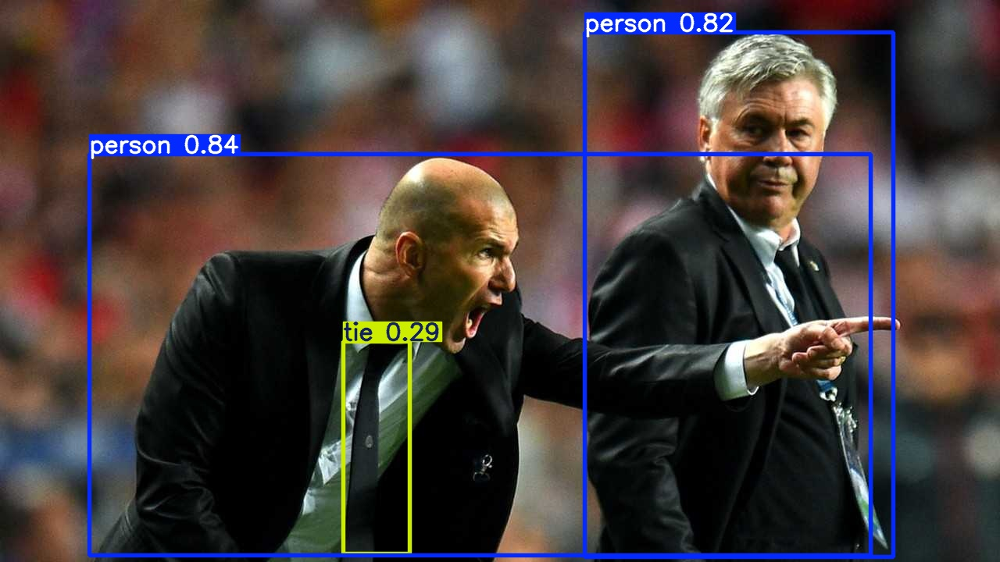
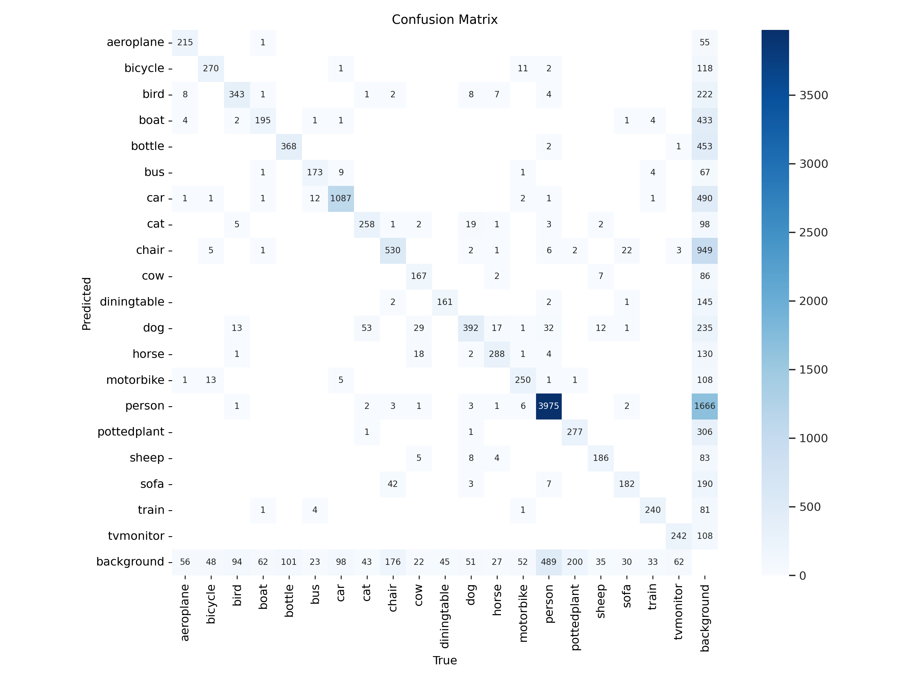
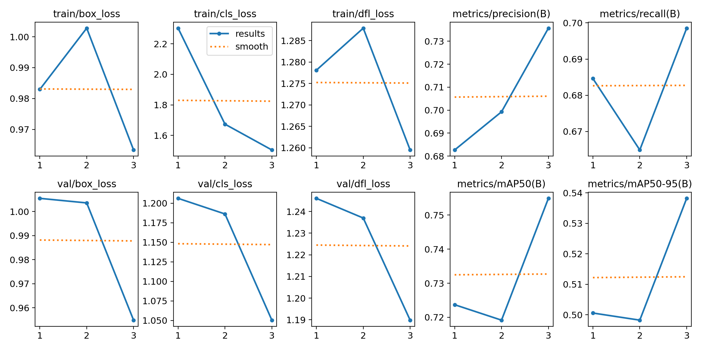
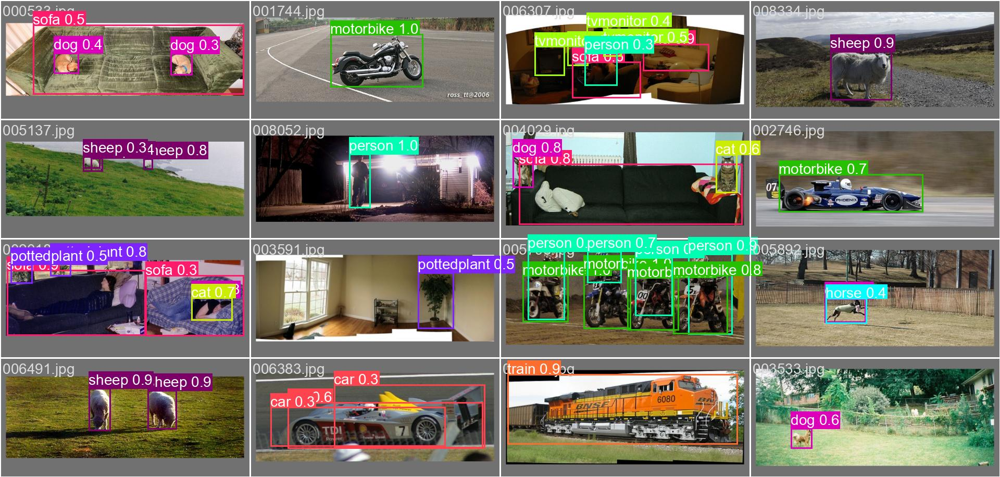
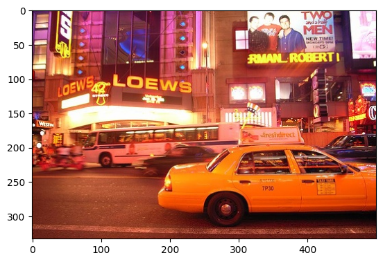
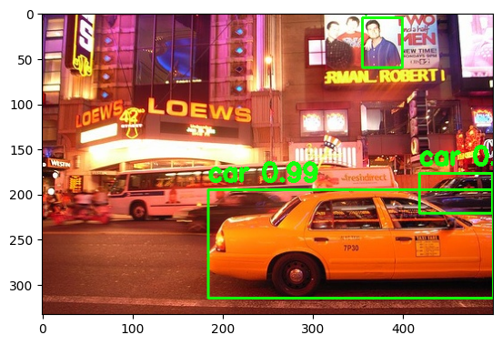

# 3-2. Object detection: VOCDetection (basic): YOLOv8 (basic script)

We aim to detect objects consisting of 20 classes: person, bird, cat, dog, horse, sheep, aeroplane, bicycle, boat,
bicycle, boat, bus, car, motorbike, train, bottle, chair, dining table, potted plant, sofa, and TV monitor. Pascal VOC
Detection Dataset (http://host.robots.ox.ac.uk/pascal/VOC/) and
YOLOv8 (https://docs.ultralytics.com/datasets/detect/voc/) are employed for the trial. The code is modified
form https://colab.research.google.com/github/ultralytics/ultralytics/blob/main/examples/tutorial.ipynb.

### 1. Load the pre-trained YOLOv8 model.

```python
# Run inference on an image with YOLOv8n
# set up device=0 refer to set cuda:0 (GPU)
!yolo predict model=yolov8n.pt source='https://ultralytics.com/images/zidane.jpg' device=0
```

Download the pre-trained YOLOv8n model, run object detection on the given image.

### 2. Perform object detection on an initial image.

```python
# Imports PIL module
from PIL import Image

# open method used to open different extension image file
im = Image.open("/content/runs/detect/predict/zidane.jpg")

# This method will show image in any image viewer
im
```

Run YOLOv8n object detection on an image, and then display the detection results.



<br />

### 3. Train the model and validate the model's performance.

```python
!yolo train data=VOC.yaml model=yolov8n.pt epochs=3 imgsz=640 device=0
```

Trains YOLOv8n on the Pascal VOC dataset for 3 epochs, using a 640x640 image size and GPU acceleration.





<br />

```python
# Validate YOLOv8n on VOC val ** the model is pretrained on COCO dataset
!yolo val model=yolov8n.pt data=VOC.yaml device=0
```

Validates YOLOv8n on the Pascal VOC dataset, using the pretrained model on the COCO dataset.

```
Ultralytics YOLOv8.2.86 🚀 Python-3.10.12 torch-2.4.0+cu121 CUDA:0 (Tesla T4, 15102MiB)
YOLOv8n summary (fused): 168 layers, 3,151,904 parameters, 0 gradients, 8.7 GFLOPs
val: Scanning /content/datasets/VOC/labels/test2007.cache... 4952 images, 0 backgrounds, 0 corrupt: 100% 4952/4952 [00:00<?, ?it/s]
                 Class     Images  Instances      Box(P          R      mAP50  mAP50-95): 100% 310/310 [00:46<00:00,  6.65it/s]
                   all       4952      12032     0.0868      0.085      0.092     0.0741
                person        204        285          0          0   0.000142   8.85e-05
               bicycle        239        337      0.873      0.776      0.879      0.644
                   car        282        459          0          0   0.000196   0.000117
            motorcycle        172        263          0          0   0.000629   0.000404
              airplane        212        469          0          0   6.72e-05   5.38e-05
                   bus        174        213      0.846      0.901      0.924      0.813
                 train        721       1201     0.0068    0.00167     0.0171     0.0139
                 truck        322        358          0          0   0.000289   0.000108
                  boat        417        756          0          0   0.000737   0.000449
         traffic light        127        244          0          0          0          0
          fire hydrant        190        206          0          0          0          0
             stop sign        418        489          0          0          0          0
         parking meter        274        348          0          0          0          0
                 bench        222        325          0          0   0.000679   0.000368
                  bird       2007       4528          0          0    0.00214    0.00131
                   cat        224        480          0          0   0.000512   0.000172
                   dog         97        242     0.0105     0.0207     0.0131    0.00921
                 horse        223        239          0          0   0.000307   0.000222
                 sheep        259        282          0          0          0          0
                   cow        229        308          0          0          0          0
Speed: 0.2ms preprocess, 3.2ms inference, 0.0ms loss, 1.5ms postprocess per image
```

💡 Learn more at https://docs.ultralytics.com/modes/val

<br />

```python
# Validate "Our model" on VOC val
!yolo val model="/content/runs/detect/train/weights/best.pt" data=VOC.yaml device=0
```

Validates your custom-trained YOLOv8 model (best.pt) on the Pascal VOC dataset.

```
Ultralytics YOLOv8.2.86 🚀 Python-3.10.12 torch-2.4.0+cu121 CUDA:0 (Tesla T4, 15102MiB)
Model summary (fused): 168 layers, 3,009,548 parameters, 0 gradients, 8.1 GFLOPs
val: Scanning /content/datasets/VOC/labels/test2007.cache... 4952 images, 0 backgrounds, 0 corrupt: 100% 4952/4952 [00:00<?, ?it/s]
                 Class     Images  Instances      Box(P          R      mAP50  mAP50-95): 100% 310/310 [00:46<00:00,  6.69it/s]
                   all       4952      12032      0.736      0.698      0.754      0.539
             aeroplane        204        285      0.892       0.67      0.835       0.57
               bicycle        239        337      0.846      0.719      0.838      0.591
                  bird        282        459      0.744      0.667      0.748      0.497
                  boat        172        263      0.394      0.574       0.44      0.264
                bottle        212        469       0.63      0.725      0.714      0.485
                   bus        174        213      0.815      0.793      0.867      0.731
                   car        721       1201      0.817      0.846      0.902        0.7
                   cat        322        358      0.848      0.733       0.84      0.623
                 chair        417        756      0.481       0.62      0.564      0.367
                   cow        127        244      0.781      0.639      0.747      0.525
           diningtable        190        206      0.674      0.631       0.68      0.487
                   dog        418        489       0.68      0.734      0.752      0.541
                 horse        274        348      0.815      0.805      0.848      0.627
             motorbike        222        325       0.84      0.709      0.818       0.55
                person       2007       4528      0.841      0.803      0.885      0.612
           pottedplant        224        480        0.6      0.404      0.461      0.252
                 sheep         97        242      0.757      0.702      0.783      0.597
                  sofa        223        239      0.604      0.728      0.723      0.574
                 train        259        282      0.864      0.784      0.862      0.587
             tvmonitor        229        308      0.791      0.676      0.781      0.595
Speed: 0.2ms preprocess, 2.8ms inference, 0.0ms loss, 1.5ms postprocess per image
Results saved to runs/detect/val2
```
💡 Learn more at https://docs.ultralytics.com/modes/val

<br />

### 4. Use the trained model to predict objects in a test image.

```python
from ultralytics import YOLO

# Load a model
# model = YOLO('yolov8n.yaml')  # build a new model from scratch
model = YOLO('yolov8n.pt')  # load a pretrained model (recommended for training)
model.to('cuda:0') # set up the model to GPU
# Use the model
results = model.train(data='VOC.yaml', epochs=3)  # train the model
results = model.val()  # evaluate model performance on the validation set
```

Loads a pre-trained YOLOv8n model, trains it on the Pascal VOC dataset for 3 epochs, and then evaluates its performance


<br />

```python
results = model.predict(source='/content/datasets/VOC/images/test2007/000014.jpg')
results
```

Predicts objects in the specified test image using your trained YOLOv8 model.

<br />

```python
from matplotlib import pyplot as plt
import cv2

img = results[0].orig_img[:, :, ::-1]
plt.imshow(img)
```

Displays the detection results on the test image.



```python
x0,y0,x1,y1 = results[0].boxes.xyxy[0].cpu().numpy().astype(int)

conf = results[0].boxes.conf.cpu().numpy()
cls = results[0].boxes.cls.cpu().numpy()
image = img.copy()
for i in range(len(results[0].boxes)):
  x0,y0,x1,y1 = results[0].boxes.xyxy[i].cpu().numpy().astype(int)
  image = cv2.rectangle(image, (x0, y0), (x1, y1), (20,255,12), 2)
  cv2.putText(image, f"{results[0].names[cls[i]]} {conf[i]:.2f}", (x0, y0-10), cv2.FONT_HERSHEY_SIMPLEX, 0.9, (20,255,12), 3)
  plt.imshow(image)
```

Prediction results, extracts the bounding boxes, class names, and confidence scores, and then visualizes them on the
image using OpenCV.



---

### **Steps Overview**
1. Load the pre-trained YOLOv8 model.
2. Perform object detection on an initial image.
3. Train the model and validate the model's performance.
4. Use the trained model to predict objects in a test image.


### **Intensive Summary**

The code runs YOLOv8 to detect objects in an image, extracts the relevant prediction data, and visualizes it using
OpenCV. Bounding boxes and labels are drawn to show detected objects along with their confidence scores. The annotated
image is then displayed, offering a clear, visual summary of the model's performance.

### **Results**

The final output is an image with detected objects, each labeled with a class name and confidence score, allowing a
quick assessment of the model's accuracy.

<br />

References:\
https://colab.research.google.com/github/pvateekul/2110531_DSDE_2024s1/blob/main/code/Week04_DL/3_2_Object_detection_VOCDetection_yolov8_basic.ipynb

